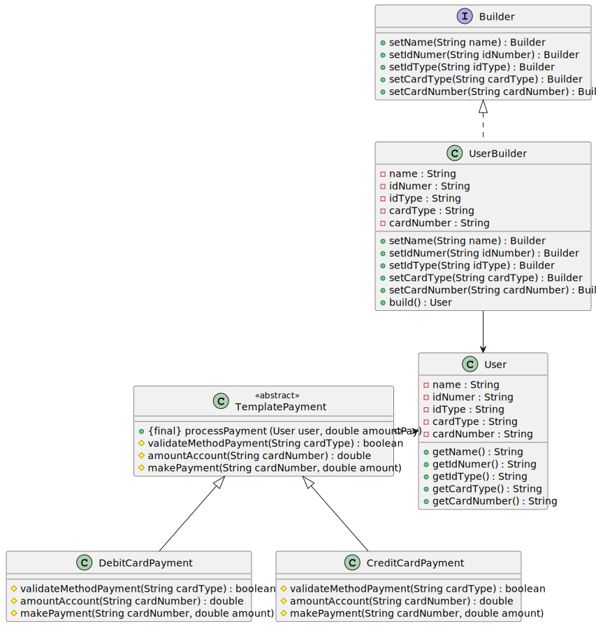

## Getting Started

Este proyecto muestra el uso del patrón de diseño `Template` y el patrón `Builder`. El ejemplo se basa es un sistema de pago electronico que tiene un proceso bien definido de pasos para realizar el pago, sin embargo, estos pasos individualmente pueden diferir, dependiendo del tipo de medio de pago digital. Por lo cual se tiene una clase plantilla que define el paso a paso del pago y clases individuales por tipo de pago (CREDITO y DEBITO).

Por otra parte para la creación del usuario se utilizo el patron Builder.

## Class Diagram

## Folder Structure

The workspace contains two folders by default, where:

- `src`: the folder to maintain sources
- `resources`: the folder to documentation project

Meanwhile, the compiled output files will be generated in the `bin` folder by default.

> If you want to customize the folder structure, open `.vscode/settings.json` and update the related settings there.

## Dependency Management

The `JAVA PROJECTS` view allows you to manage your dependencies. More details can be found [here](https://github.com/microsoft/vscode-java-dependency#manage-dependencies).
