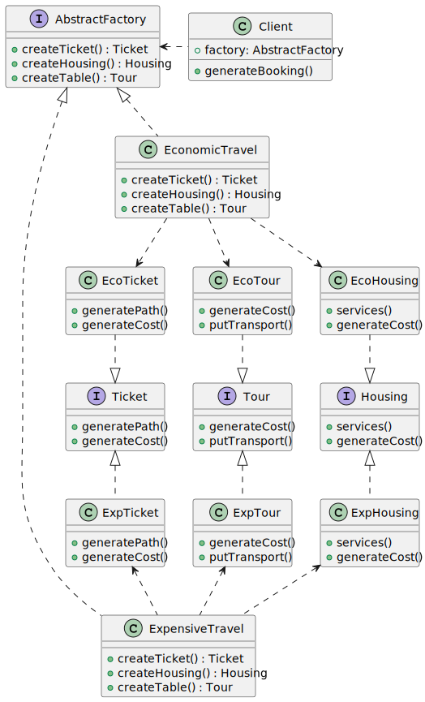

## Getting Started

Proyecto ejemplo en Java, para mostrar la aplicabilidad del patron de diseño `Abstract Factory`. El escenario del proyecto es de un sistema de venta de planes de viajes, donde se incluyen varios servicios. Para el ejemplo una reserva esta asociada a dos categorios extendibles, y cada reserve incluye ticketes de vuelo, alojamiento y tours.

## Class Diagram

## Folder Structure

The workspace contains two folders by default, where:

- `src`: the folder to maintain sources

Meanwhile, the compiled output files will be generated in the `bin` folder by default.

> If you want to customize the folder structure, open `.vscode/settings.json` and update the related settings there.

## Dependency Management

The `JAVA PROJECTS` view allows you to manage your dependencies. More details can be found [here](https://github.com/microsoft/vscode-java-dependency#manage-dependencies).
