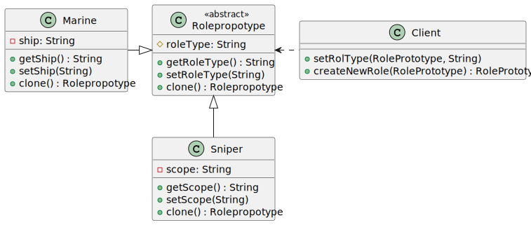

## Getting Started

Este proyecto muestra el uso del patron `prototype`, desarrollado en Java. El escenario del prouyecto es basado en un juego de roles donde estan configurados los roles disponibles. Para este juego se cuenta con 2 roles, francotirador y marino. Por lo cual, una vez existen los primeros objetos de cada rol, los siguientes objetos son creados por medio de copias.

## Class Diagram

## Folder Structure

The workspace contains two folders by default, where:

- `src`: the folder to maintain sources

Meanwhile, the compiled output files will be generated in the `bin` folder by default.

> If you want to customize the folder structure, open `.vscode/settings.json` and update the related settings there.

## Dependency Management

The `JAVA PROJECTS` view allows you to manage your dependencies. More details can be found [here](https://github.com/microsoft/vscode-java-dependency#manage-dependencies).
