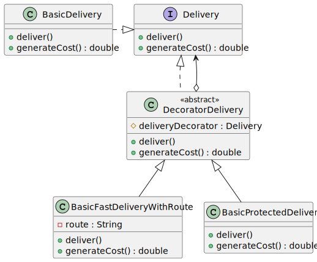

## Getting Started

Proyecto en Java de ejemplo del patron de diseño `decorator`. El ejemplo se basa un escenario de una empresa de envios y entregas.

La empresa inicialmente realizaba entregas basicas y tenia una clase concreta para el proceso de la entrega. A lo cual se decidio utilizar el patron de diseño decorator, debido a que el area de innovación solicito la creación de nuevos modelos de entrega sin que se afectara la funcionalidad ya construida. En el ejemplo se muestra los dos nuevos mecanismos de entrega: Entrega rapida y Entrega protegida

## Class Diagram

## Folder Structure

El espacio de trabajo esta comprendido por:

- `src`: the folder to maintain sources
- `resources`: the folder to maintain additional files, documentations

> If you want to customize the folder structure, open `.vscode/settings.json` and update the related settings there.

## Dependency Management

The `JAVA PROJECTS` view allows you to manage your dependencies. More details can be found [here](https://github.com/microsoft/vscode-java-dependency#manage-dependencies).
