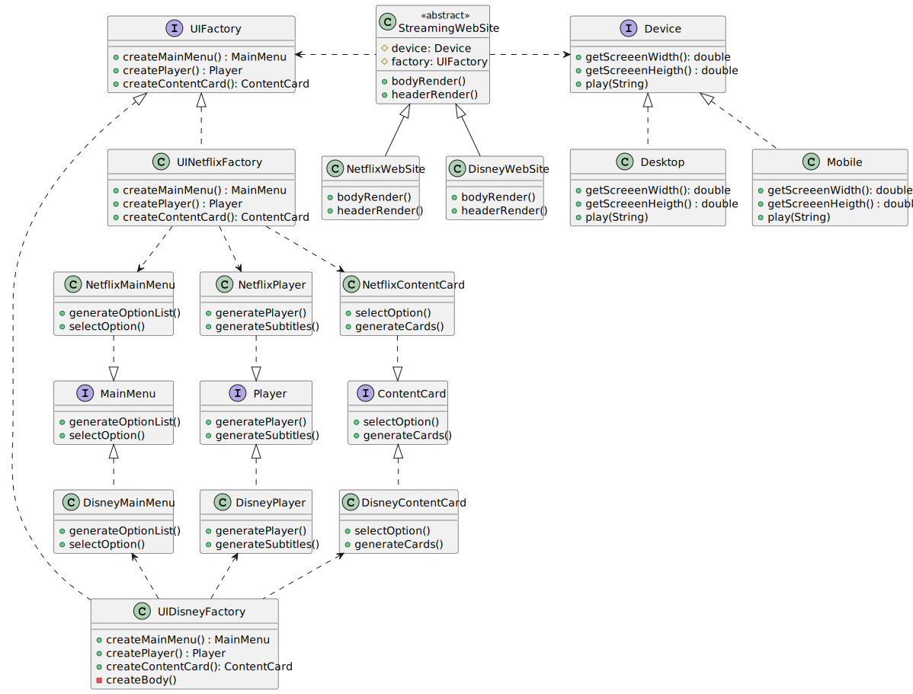

## Getting Started

Proyecto ejemplo en Java, para mostrar la aplicabilidad del patron de diseño `Bridge`. El escenario del proyecto es de un sistema generalizado de aplicaciones de streaming de video, las cuales hoy en día varian tanto en la empresa proveedora del producto (Netfilx, Disney, etc), como de los dispositivos.

Sobre el proyecto se utilizo el patron `Abstract factory` para la creacion de los UI de cada aplicación.

## Class Diagram

## Folder Structure

The workspace contains two folders by default, where:

- `src`: the folder to maintain sources
- `lib`: the folder to maintain dependencies

Meanwhile, the compiled output files will be generated in the `bin` folder by default.

> If you want to customize the folder structure, open `.vscode/settings.json` and update the related settings there.

## Dependency Management

The `JAVA PROJECTS` view allows you to manage your dependencies. More details can be found [here](https://github.com/microsoft/vscode-java-dependency#manage-dependencies).
